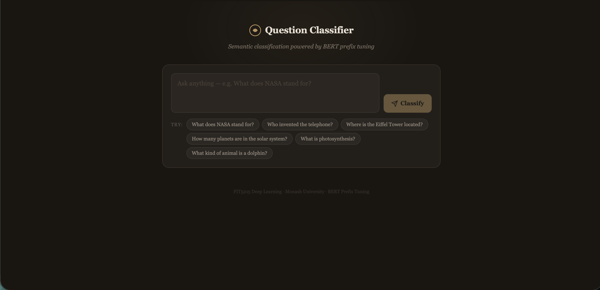

# Question Classifier

A full-stack NLP application that classifies questions into 6 semantic categories using a BERT prefix-tuning model trained for FIT5215 Deep Learning (Monash University).

**Categories:** ABBR · DESC · ENTY · HUM · LOC · NUM

---
## Preview



## Project Structure

```
question-classifier/
├── backend/
│   ├── src/
│   │   ├── __init__.py
│   │   ├── utils.py           # seed_all(), device, LABEL_CLASSES
│   │   ├── data_manager.py    # DataManager — download, tokenise, split
│   │   ├── models.py          # TransformerClassifier + PrefixTuningForClassification
│   │   └── trainers.py        # BaseTrainer + FineTunedBaseTrainer
│   ├── models/
│   │   └── q4_prefix_tuning_best.pt   ← place your trained model here
│   ├── data/                  # auto-created on first run
│   ├── app.py                 # FastAPI server
│   └── requirements.txt
├── frontend/
│   ├── src/
│   │   ├── App.jsx            # Main React UI
│   │   ├── main.jsx
│   │   └── index.css
│   ├── index.html
│   ├── package.json
│   ├── vite.config.js
│   ├── tailwind.config.js
│   └── .env.example
├── notebooks/
│   └── Notebook3_Transformers.ipynb
└── README.md
```

---

## Setup

### 1. Clone and add your model

```bash
git clone https://github.com/YOUR_USERNAME/question-classifier.git
cd question-classifier

# Copy your trained model weights into:
cp /path/to/q4_prefix_tuning_best.pt backend/models/
```

> **Note:** If the `.pt` file is over 100 MB, use [Git LFS](https://git-lfs.com) or host it externally and update `MODEL_PATH` in `backend/app.py`.

---

### 2. Backend

```bash
cd backend

# Create and activate virtual environment
python -m venv venv
source venv/bin/activate        # Mac/Linux
# venv\Scripts\activate         # Windows

# Install dependencies
pip install -r requirements.txt

# Start the server
uvicorn app:app --reload --port 8000
```

API will be available at `http://localhost:8000`  
Interactive docs at `http://localhost:8000/docs`

---

### 3. Frontend

```bash
cd frontend

# Install dependencies
npm install

# Copy env file and set API URL
cp .env.example .env

# Start dev server
npm run dev
```

Frontend will be available at `http://localhost:5173`

---

## API Endpoints

| Method | Endpoint | Description |
|--------|----------|-------------|
| GET | `/` | Health check message |
| GET | `/health` | Returns status and device info |
| GET | `/classes` | Returns list of class labels |
| POST | `/predict` | Classifies a question |

### POST `/predict`

**Request:**
```json
{ "question": "What does NASA stand for?" }
```

**Response:**
```json
{
  "question": "What does NASA stand for?",
  "predicted_class": "ABBR",
  "confidence": 0.9823,
  "all_scores": {
    "ABBR": 0.9823,
    "DESC": 0.0071,
    "ENTY": 0.0043,
    "HUM": 0.0031,
    "LOC": 0.0018,
    "NUM": 0.0014
  }
}
```

---

## Models

### Custom Transformer Classifier (`TransformerClassifier`)
Built from scratch with `MultiHeadAttention`, `PositionalEncoding`, and stacked `EncoderLayer` blocks. Uses masked mean pooling over PAD tokens.

### BERT Prefix Tuning (`PrefixTuningForClassification`)
Frozen `bert-base-uncased` encoder with a learnable soft prefix of length 5. Only the prefix embeddings and the classification head are trained. **This is the deployed model.**

---

## Pushing to GitHub

```bash
git init
git add .
git commit -m "Initial commit: Question Classifier full-stack app"
git branch -M main
git remote add origin https://github.com/YOUR_USERNAME/question-classifier.git
git push -u origin main
```

If your model file is large, set up Git LFS first:
```bash
git lfs install
git lfs track "backend/models/*.pt"
git add .gitattributes
```
